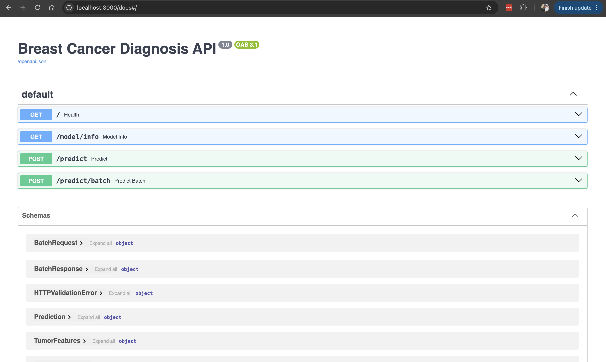
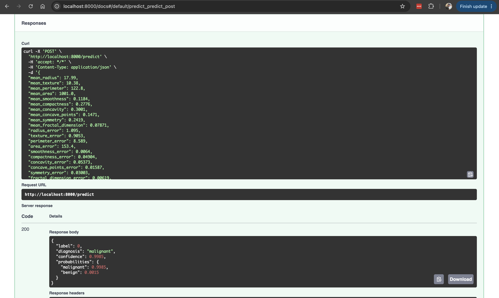

# Breast Cancer Diagnosis API

A machine learning inference service built with **FastAPI** that classifies breast tumors as **malignant** or **benign** from 30 cell-nucleus measurements. The project covers the full serving workflow: data loading, model training and evaluation, a validated REST API, automated tests, and containerized deployment with Docker.

---

## Table of Contents
- [Overview](#overview)
- [Tech Stack](#tech-stack)
- [Project Structure](#project-structure)
- [Dataset](#dataset)
- [Model](#model)
- [Setup](#setup)
- [Usage](#usage)
- [API Reference](#api-reference)
- [Testing](#testing)
- [Docker Deployment](#docker-deployment)
- [Results](#results)
- [Screenshots](#screenshots)
- [Acknowledgements](#acknowledgements)

---

## Overview

This project:
- Trains a gradient boosting classifier on the Wisconsin Breast Cancer dataset
- Saves the trained model along with its evaluation metrics
- Serves predictions through a REST API with single and batch endpoints
- Validates every request with Pydantic (missing or negative values are rejected)
- Returns the predicted diagnosis, a confidence score, and class probabilities
- Includes a `pytest` test suite and a `Dockerfile` for deployment

---

## Tech Stack

| Component | Tool |
|---|---|
| API framework | FastAPI, Uvicorn |
| Data validation | Pydantic |
| Machine learning | scikit-learn |
| Data handling | pandas |
| Model persistence | joblib |
| Testing | pytest, FastAPI TestClient |
| Containerization | Docker |

---

## Project Structure

```
cancer-fastapi-lab/
├── assets/                    # Screenshots used in this README
├── data/
│   └── sample_request.json    # Example input for /predict
├── model/
│   ├── cancer_model.pkl       # Trained model (generated, not tracked)
│   └── metadata.json          # Model type, classes, evaluation metrics
├── src/
│   ├── __init__.py
│   ├── data.py                # Dataset loading and train/test split
│   ├── train.py               # Model training, evaluation, and saving
│   ├── predict.py             # Model loading and inference logic
│   └── main.py                # FastAPI app and endpoints
├── tests/
│   └── test_api.py            # API tests
├── Dockerfile
├── requirements.txt
├── .gitignore
└── README.md
```

---

## Dataset

**Wisconsin Diagnostic Breast Cancer**, loaded directly from scikit-learn (`sklearn.datasets.load_breast_cancer`), so no download is needed.

| Property | Value |
|---|---|
| Samples | 569 |
| Features | 30 numeric measurements |
| Classes | `malignant` (0), `benign` (1) |
| Split | 80% train / 20% test, stratified |

The features describe the mean, standard error, and worst value of 10 characteristics of cell nuclei (radius, texture, perimeter, area, smoothness, compactness, concavity, concave points, symmetry, fractal dimension). Spaces in feature names are replaced with underscores (e.g. `mean radius` → `mean_radius`) so they work as JSON fields.

---

## Model

A scikit-learn `Pipeline`:

1. **StandardScaler**: normalizes all features
2. **GradientBoostingClassifier**: `n_estimators=200`, `learning_rate=0.05`, `max_depth=3`

After training, the model is saved to `model/cancer_model.pkl` and its metrics to `model/metadata.json`.

---

## Setup

**Prerequisites:** Python 3.10+, Git

```bash
# 1. Clone the repository
git clone https://github.com/kushpatel02/cancer-fastapi-lab.git
cd cancer-fastapi-lab

# 2. Create and activate a virtual environment
python -m venv fastapi_lab1_env
source fastapi_lab1_env/bin/activate        # Windows: fastapi_lab1_env\Scripts\activate

# 3. Install dependencies
pip install -r requirements.txt
```

---

## Usage

### 1. Train the model
```bash
cd src
python train.py
```
Expected output:
```
Model saved | {'accuracy': 0.9561, 'f1': 0.966, 'roc_auc': 0.9911}
```

### 2. Start the API
From `src/`:
```bash
uvicorn main:app --reload
```
The API runs at http://localhost:8000, and interactive docs (Swagger UI) are at http://localhost:8000/docs.

### 3. Make a prediction
From the repository root:
```bash
curl -X POST http://localhost:8000/predict \
  -H "Content-Type: application/json" \
  -d @data/sample_request.json
```

---

## API Reference

| Method | Endpoint | Description |
|---|---|---|
| `GET` | `/` | Health check |
| `GET` | `/model/info` | Model type, classes, and evaluation metrics |
| `POST` | `/predict` | Predict a single sample |
| `POST` | `/predict/batch` | Predict up to 500 samples |

### `POST /predict`

**Request body:** all 30 features, each a number `>= 0`. See [`data/sample_request.json`](data/sample_request.json).
```json
{
  "mean_radius": 17.99,
  "mean_texture": 10.38,
  "...": "...",
  "worst_fractal_dimension": 0.1189
}
```

**Response:**
```json
{
  "label": 0,
  "diagnosis": "malignant",
  "confidence": 0.9985,
  "probabilities": { "malignant": 0.9985, "benign": 0.0015 }
}
```

### `POST /predict/batch`

**Request body:**
```json
{ "samples": [ { ...sample 1... }, { ...sample 2... } ] }
```

**Response:**
```json
{ "count": 2, "predictions": [ { ... }, { ... } ] }
```

### Error responses

| Status | Cause |
|---|---|
| `422` | Missing field, wrong type, or negative value |
| `503` | Model not trained yet; run `python train.py` |

---

## Testing

From the repository root:
```bash
pytest -v
```

The suite covers the health check, model info, single prediction, batch prediction, and input validation (negative values and missing fields). If no trained model exists, the tests train one first.

---

## Docker Deployment

```bash
# Build the image (the model is trained during the build)
docker build -t cancer-api .

# Run the container
docker run -p 8000:8000 cancer-api
```
The API is then available at http://localhost:8000/docs.

---

## Results

Evaluated on the held-out 20% test set (114 samples):

| Metric | Score |
|---|---|
| Accuracy | 0.956 |
| F1 score | 0.966 |
| ROC-AUC | 0.991 |

---

## Screenshots

**API documentation (Swagger UI)**


**Prediction**


---